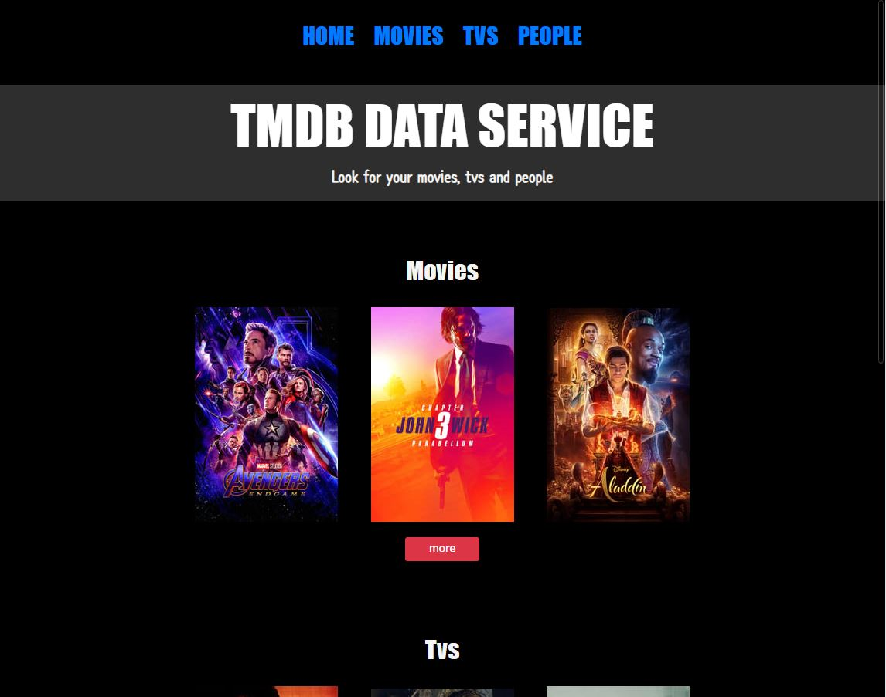
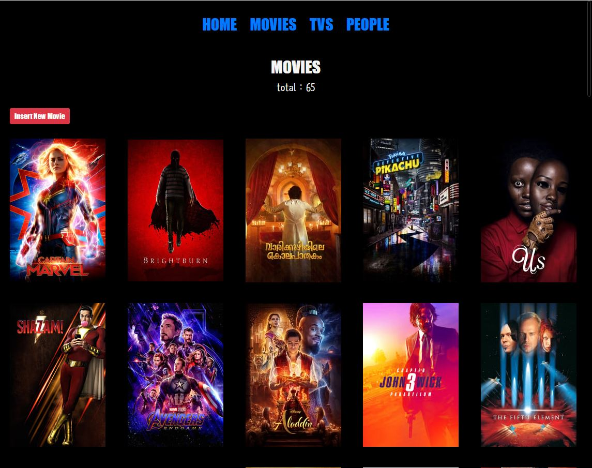
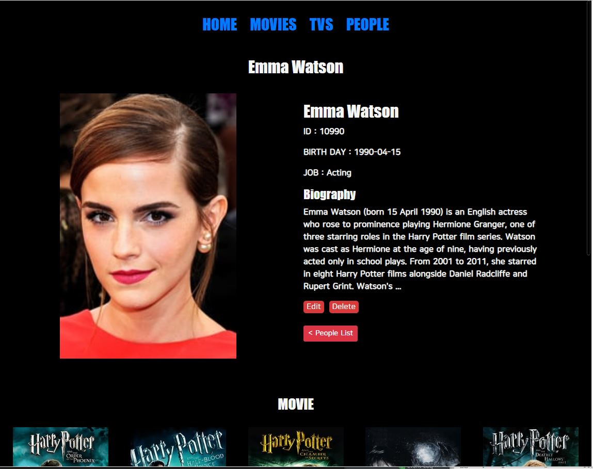
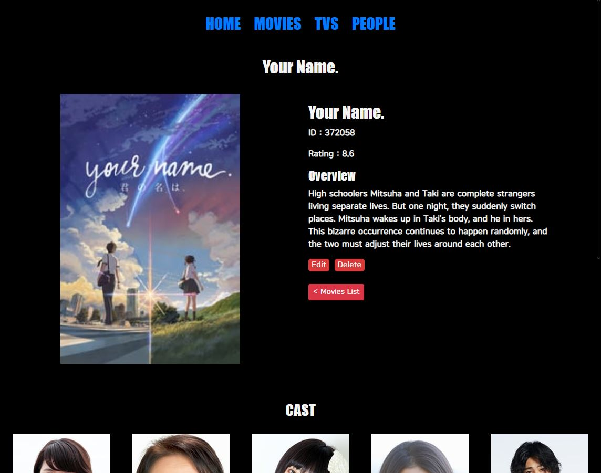
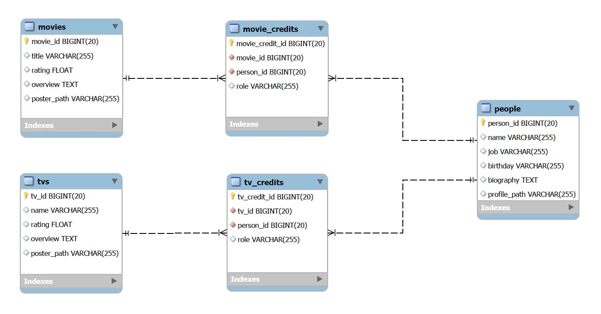
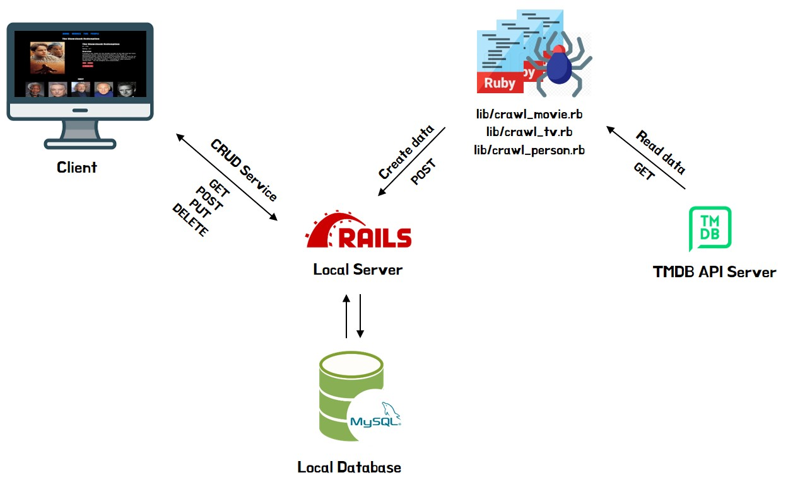
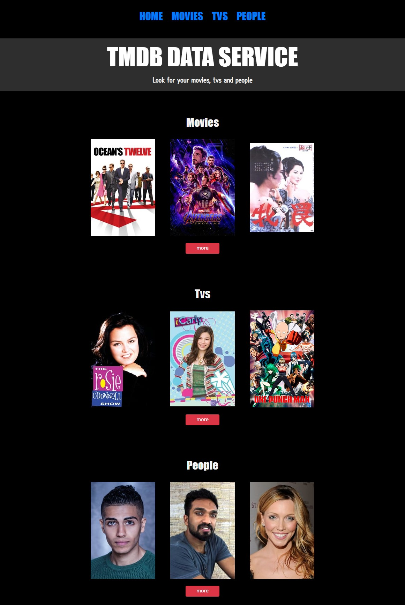
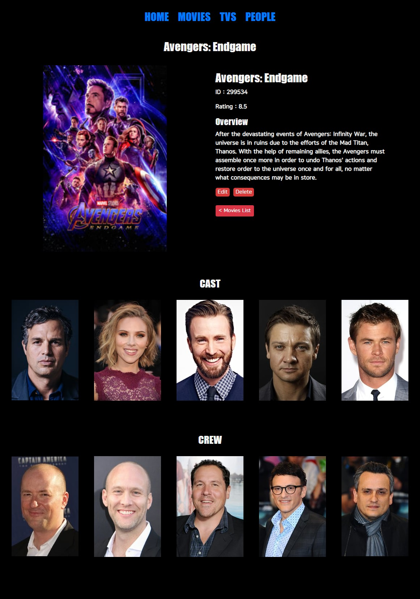
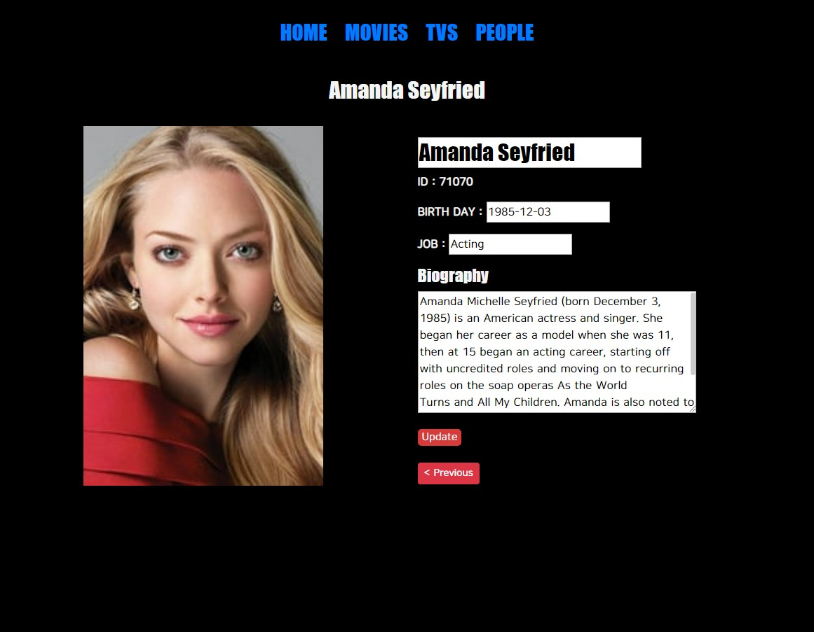
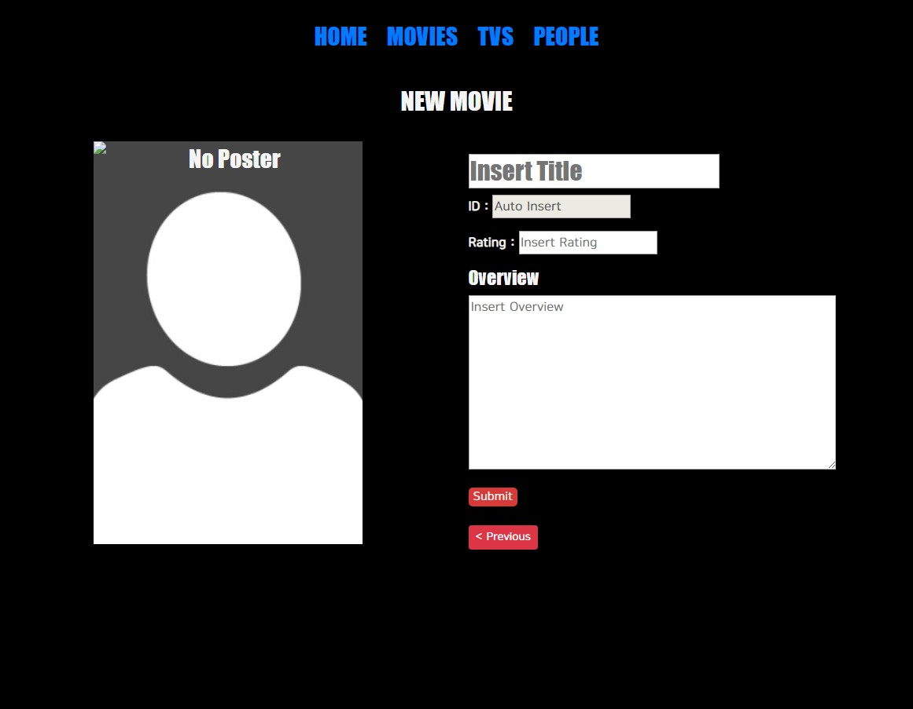

# rails-tmdb

#### TMDB를 이용하여 Movie, Tv, Person DB를 구축하고 간단한 웹페이지를 통해 Data의 CRUD를 서비스

<div>
  <div width='100%'>
    
    
  </div>
  <div width='100%'>
    
    
  </div>
</div>
<br>

<br/>

## *Introduction*


### Summary
> - Movie, Tv, Person 을 Database에 저장할 수 있도록 Schema를 설계하고 DB를 구축 
> 
> - Data를 만들기 위해 TMDB API에 GET 요청을 통해 Movie, Tv, Person 정보를 Crawling 하며, Crawler는 Ruby 스크립트로 구현
>
> - Ruby on Rails 프레임워크를 이용하여 간단한 웹페이지를 구축 
> 
> - 웹 브라우저를 통해 CRUD 서비스
> 
> - 서버는 REST하게 설계되었기 때문에 HTTP 의 ruequst 이용한 CRUD 서비스도 가능


### Requirements
> - [RVM](https://rvm.io/)
> - [Ruby 2.5.3](https://www.ruby-lang.org/en/news/2018/10/18/ruby-2-5-3-released/) 
> - [Bundler 2.0.1](https://rubygems.org/gems/bundler/versions/2.0.1)
> - [Rails 5.2.3](https://rubygems.org/gems/rails/versions/5.2.3)
> - [MySQL 5.6](https://dev.mysql.com/downloads/mysql/5.6.html)


### End-points

> **Resource Modeling**
> 
> - [RoR 개발 가이드 문서](https://guides.rorlab.org/routing.html)를 참조하여 RESTful하게 리소스를 모델링
> - 모든 리소스 (Movie, Tv, Person, MovieCredit, TvCredit) 들은 다음과 같은 모델링 원칙을 준수
> 
> |  HTTP |  Path |  Controller#action |  목적 |
> | --- | --- | --- | --- |
> |**GET** |/movies|movie#index|모든 Movie 표시|
> |**GET** |/movies/new|movie#new|Movie 작성용 양식을 반환|
> |**GET** |/movies/:movie_id|movie#show|하나의 Movie 표시|
> |**POST** |/movies|movie#create|하나의 Movie 생성|
> |**GET** |/movies/:movie_id/edit|movie#edit|Movie 수정용 양식을 반환|
> |**PUT** |/movies/:movie_id|movie#update|하나의 Movie 수정|
> |**DELETE** |/movies/:movie_id|movie#destroy|하나의 Movie 삭제|
> 
> **Route**
> 
> - `config/routes.rb`
> ```ruby
> Rails.application.routes.draw do
> 
>   # Home endpoint
>   root 'home#index'
>   get 'home/index' => 'home#index'
> 
>   # Movies CRUD endpoints
>   get 'movies' => 'movie#index'
>   get 'movies/new' => 'movie#new'
>   get 'movies/:movie_id' => 'movie#show'
>   post '/movies' => 'movie#create'
>   get 'movies/:movie_id/edit' => 'movie#edit'
>   put 'movies/:movie_id' => 'movie#update'
>   delete 'movies/:movie_id' => 'movie#destroy'
> 
>   # Tvs CRUD endpoints
>   get 'tvs' => 'tv#index'
>   get 'tvs/new' => 'tv#new'
>   get 'tvs/:tv_id' => 'tv#show'
>   post '/tvs' => 'tv#create'
>   get 'tvs/:tv_id/edit' => 'tv#edit'
>   put 'tvs/:tv_id' => 'tv#update'
>   delete 'tvs/:tv_id' => 'tv#destroy'
> 
>   # People CRUD endpoints
>   get 'people' => 'person#index'
>   get 'people/new' => 'person#new'
>   get 'people/:person_id' => 'person#show'
>   post '/people' => 'person#create'
>   get 'people/:person_id/edit' => 'person#edit'
>   put 'people/:person_id' => 'person#update'
>   delete 'people/:person_id' => 'person#destroy'
> 
>   # MovieCredits CR endpoints
>   get 'movie_credits' => 'movie_credit#index'
>   post '/movie_credits' => 'movie_credit#create'
> 
>   # TvCredits CR endpoints
>   get 'tv_credits' => 'tv_credit#index'
>   post '/tv_credits' => 'tv_credit#create'
> 
> end
> 
> ```

### Models
> 
> 


### Service flow
> 
> 

<br/>

## *Installation*

### Clone project
> 
> - Github repository를 clone
> ```bash
> $ git clone https://github.com/meh9184/rails-tmdb
> ```
> 

### Configure  db connection
> 
> - `config/database.yml` 파일 상단의
> - username, password 입력
> 
> ```yml
> default: &default
>   adapter: mysql2
>   encoding: utf8
>   pool: 5
>   username: YOUR_USERNAME   # 자신의 DB username 입력
>   password: YOUR_PASSWORD   # 자신의 DB password 입력
>   host: 127.0.0.1
>   socket: /tmp/mysql.sock
> 
> development:
>   <<: *default
>   database: tmdb_development
> 
> test:
>   <<: *default
>   database: tmdb_test
> ```
> 
> - `lib/crawl_movie.rb`, `lib/crawl_tv.rb`, `lib/crawl_people.rb` 파일 상단의
> -  $tmdb_api_key 입력
> 
> ```ruby
> #!/usr/bin/env ruby
> require 'net/http'
> require 'json'
> 
> # TMDB API KEY 셋팅
> $tmdb_api_key = YOUR_TMDB_API_KEY   # 자신의 TMDB api_key 입력
> 
> # TMDB API에 GET 요청 전송하는 함수
> def getDataFromApi(uri)
>     return JSON.parse(Net::HTTP.get(uri))
> end
> ```

### Install bundle 

> - `shell command` 프로젝트 루트 위치에서 입력
> ```bash
> $ bundle install
> ```

### Setup database
> - `shell command` 프로젝트 루트 위치에서 입력
> ```bash
> $ rake db:create
> $ rake db:migrate
> ```

<br/>

## *Usage*

### Run server

> - configuration과 bundle install, db setup이 끝났으면 로컬 서버를 실행
> - `shell command` 프로젝트 루트 위치에서 입력
> ```bash
> $ rails server
> ```

### Generate data

> - 서버 setting 및 run 까지 완료했지만, 초기 DB 는 비어있는 상태
> - 데이터를 Crawl하는 Ruby script를 실행하여 TMDB로 부터 Data Set 생성 가능 
> - **Crwaler Usage**
> 
>     1. 단일 수집
>         - movie_id = 372058인 Movie
>         - tv_id = 63926인 TV
>         - person_id = 1245인 Person
>             ```bash
>             $rails runner lib/crawl_movie.rb 372058
>             $rails runner lib/crawl_tv.rb 63926
>             $rails runner lib/crawl_person.rb 1245
>             ```
>     2. 다수 수집
>         - movie_id = 372058, 637, 129인 Movie
>         - tv_id = 63926, 66732, 1396인 TV
>         - person_id = 1245, 9827, 6384인 Person
>             ```bash
>             $rails runner lib/crawl_movie.rb 372058 637 129
>             $rails runner lib/crawl_tv.rb 63926 66732 1396
>             $rails runner lib/crawl_person.rb 1245 9827 6384
>             ```
>     3. 평점 순위 높은 순서대로 수집 (person은 평점 존재하지 않음)
>         - 평점 순위 상위 5개 Movie
>         - 평점 순위 상위 50개 TV
>             ```bash
>             $rails runner lib/crawl_movie.rb -rating 5
>             $rails runner lib/crawl_tv.rb -rating 50
>             ```
>     4. 인기 있는 순서대로 수집
>         - 요즘 가장 인기 있는 상위 32개 Moive
>         - 요즘 가장 인기 있는 상위 7개 TV
>         - 요즘 가장 인기 있는 상위 15개 People
>             ```bash
>             $rails runner lib/crawl_movie.rb -popularity 32
>             $rails runner lib/crawl_tv.rb -popularity 7
>             $rails runner lib/crawl_person.rb -popularity 15
>             ```
>     5. 한번의 명령으로 -rating -popular 옵션의 데이터들을 수집
>         - Movie, Tv, People 모두 상위 10개의 -rating -popular 수집하고 싶은 경우
>         - 10을 파라미터로 넘기면 약 5분 내외 소요
>             ```bash
>             $rails runner lib/crawl_all.rb 10
>             ```
> - 웹 브라우저로 접속하여 데이터 잘 추가 되었는지 확인
>   [http://localhost:3000/](http://localhost:3000/)
> 


<br/>

## *Results*

### Views
> 
> ### Index
> - `app/views/home/index.html.erb`
> - `app/views/movie/index.html.erb`
> - `app/views/tv/index.html.erb`
> - `app/views/person/index.html.erb`
> 
> |  HTTP |  Path |  Controller#action |  목적 |
> | --- | --- | --- | --- |
> |**GET** |/resources|resource#index|모든 Resource 표시|
>
> 
> <br/>
> <br/>
> 
> ### Show
> - `app/views/movie/show.html.erb`
> - `app/views/tv/show.html.erb`
> - `app/views/person/show.html.erb`
> 
> |  HTTP |  Path |  Controller#action |  목적 |
> | --- | --- | --- | --- |
> |**GET** |/resources/:resource_id|resource#show|하나의 Resource 표시|
>
> 
> <br/>
> <br/>
>  
> ### Edit
> - `app/views/movie/edit.html.erb`
> - `app/views/tv/edit.html.erb`
> - `app/views/person/edit.html.erb`
> 
> |  HTTP |  Path |  Controller#action |  목적 |
> | --- | --- | --- | --- |
> |**GET** |/resources/:resource_id/edit|resource#edit|Resource 수정용 양식을 반환|
>
> 
> <br/>
> <br/>
>  
> ### New
> - `app/views/movie/new.html.erb`
> - `app/views/tv/new.html.erb`
> - `app/views/person/new.html.erb`
> 
> |  HTTP |  Path |  Controller#action |  목적 |
> | --- | --- | --- | --- |
> |**GET** |/resources/:resource_id/new|resource#new|Resource 작성용 양식을 반환|
>
> 
> <br/>
> <br/>
> 

<br/>

## *Addition Commentary*
> 
### Some rules
> - 가독성과 크롤링 시간 효율을 위해 크롤링 수행시 Movie 및 TV의 cast와 crew는 최대 5개씩만 수집하도록 제한하였으며, Person의 영화 출연작과 TV 출연작 역시 5개씩 수집하도록 제한하였습니다.
> - Home 인덱스 페이지에서 Movies, Tvs, People 각각 3개의 대표 데이터는 무작위로 뽑고, 이미지가 존재하는 data 중에서 선별합니다.
> - Movie, Tv 인덱스 페이지에서 데이터는 업데이트 시간 내림차순으로 정렬합니다.
> - People 인덱스 페이지에서 데이터는 업데이트 시간 오름차순으로 정렬합니다.
> 

### Issues
> - 현재의 Crawler 는 사실상 평점/인기 높은 데이터를 순차적으로 가져오는 Scraper 정도 되는것 같음. API를 통해 리소스들에 타고 들어가면서 데이터를 수집하는 정통적인 Crawler 개발 필요
> - TV의 에피소드, 시리즈 정보는 데이터 모델링 하지 못함. Ruby on Rails 의 모델링 문법과 방법에 대해 더 공부할 필요 있음.
> 

### Tools for Windows OS Users
> - [WSL (Windows Subsystem for Linux)](https://docs.microsoft.com/ko-kr/windows/wsl/install-win10)
> - [VSCode](https://code.visualstudio.com/docs/?dv=win)
> - [Mysql Workbench](https://www.mysql.com/products/workbench/)
> - [Postman](https://www.getpostman.com/downloads/)
> - [Github](https://github.com/meh9184/tmdb-rails)
> 

<br/>

## *References*
> 
> - https://medium.com/@shaircast/ruby-on-rails-on-wsl-%EC%9C%88%EB%8F%84%EC%9A%B0-10%EC%97%90%EC%84%9C-%EB%A0%88%EC%9D%BC%EC%A6%88-%EC%84%A4%EC%B9%98%ED%95%98%EA%B8%B0-9a6164df51f
> - https://docs.microsoft.com/ko-kr/windows/wsl/install-win10
> - https://gorails.com/setup/windows/10
> - https://medium.com/@colinrubbert/installing-ruby-on-rails-in-windows-10-w-bash-postgresql-e48e55954fbf
> - https://github.com/luciuschoi/wsl_setting_for_rails
> - https://medium.com/@joystar/%EC%9C%88%EB%8F%84%EC%9A%B0-wsl-18-04%EC%97%90%EC%84%9C-%EB%A0%88%EC%9D%BC%EC%A6%88-%EA%B0%9C%EB%B0%9C%ED%99%98%EA%B2%BD-%EC%84%A4%EC%A0%95%ED%95%98%EA%B8%B0-252b04dae45b
> - https://rubykr.github.io/rails_guides/getting_started.html
> 
